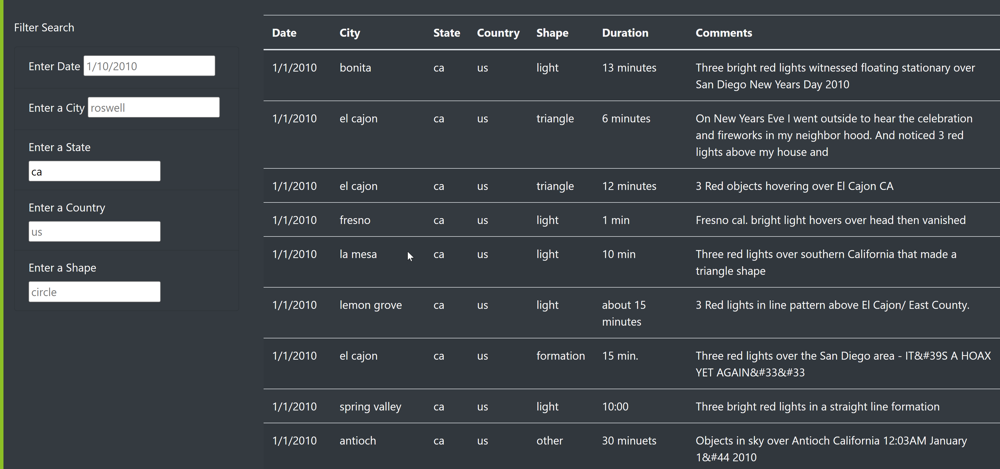

# UFOs
## Overview of Project
UFOs the goal of this project is to make website where people can search for UFOs sightings with diffrent filters. Dana started this project who later decided to implement filter the data by date, city, state, country and shape.

## Results 
I implemented search functionality with the user friendly design. Users can search for UFOs sightings with diffrent search criteria. The search results are displayed in an easy to read format.

## Summary
Overall this project has been successful in achieving its objective of providing a database of UFO sightings for users to search and explore with different filters.